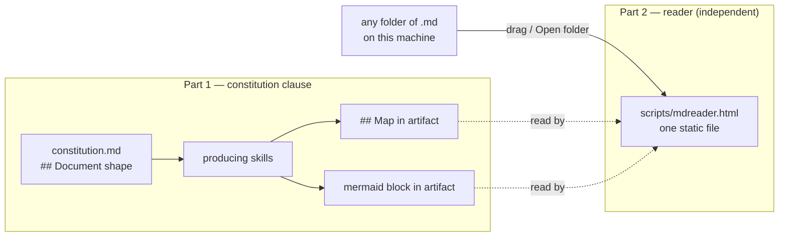

status: accepted
updated: 2026-08-30

# Spec 004 — Markdown navigability: map layer, diagram preference, static reader

## Map

- Problem — 31
- Goals — 9
- Non-Goals — 17
- Considered Approaches — 2
  - Option A — write-time constraints — 6
  - Option B — read-time tool only — 6
  - Option C — document structure — 6
  - Sub-decision — mechanical spine vs. guideline — 9
- Decision — 26
- Design — 17
  - Part 1 — constitution clause — 30
  - Part 2 — the reader — 21
    - Chunking — 21
    - Navigation — 10
    - Links — 8
    - Reading design — 25
  - Fence-awareness is load-bearing — 13
  - Measured chunking — 18
  - Prototype evidence — 16
- Open Questions — 14

## Problem

The markdown in this tree is hard to enter. Not badly written — hard to *enter*. The
worst offenders are well-structured already:

| lines | file | producer |
|---|---|---|
| 835 | `scripts/thunderbird-mcp/docs/filter-api-research.md` | ad-hoc research |
| 640 | `docs/skill-ideas/_assessments/2026-08-29.md` | forge |
| 628 | `specs/003-cross-store-search/plan.md` | plan-doc |
| 308 | `specs/003-cross-store-search/spec.md` | designit |
| 280 | `docs/plans/001-skill-pipeline-framework.md` | hand-written |

Three distinct failure modes, only overlapping in symptom:

- **No altitude gradient.** `plan.md` is uniformly load-bearing — every line is a
  decision, a path, or a verify command. There is no way to read it at 30%.
- **Wrong read mode for the shape.** That plan is a *reference* file, consumed one step
  at a time by `/implement`, but it offers only one entry point: line 1. You never need
  all 628 lines at once, and the file does not say so.
- **Accretion.** The 640-line assessment is two forge runs concatenated —
  `# Skill-idea assessment` appears at line 1 and again at line 301. It got long by
  appending. Nobody decided it should be 640 lines.

The forcing constraint: **the problem is access, not volume.** Plan 003 earns its 628
lines; it is a build spec with executable verify commands. Compressing it makes it a
worse plan. So no fix here may shorten a document.

Reader is the human, not the model. Scope is all long markdown in the tree, not only
pipeline artifacts.

## Goals

- A reader can decide *where to enter* a long document without reading it.
- Where content is a structure (dependency order, data flow, state machine), it is shown
  as a structure, not enumerated in prose.
- Navigation works both in raw markdown (GitHub, terminal, editor) and in a browser.
- Near-zero standing cost: no build step in the pipeline, no new artifact status, no
  skill invoking another.

## Non-Goals

- **Shortening anything.** No length caps on any artifact. See Problem.
- Rewriting or restructuring existing documents.
- Replacing `/tldr` (judgment, prose, "what does it say") or `/distill` (judgment,
  ephemeral, "what would I lead with"). This answers a third question — "what is in here
  and where" — and is the only one of the three derived mechanically.
- Any change to the artifact ledger, status vocabularies, or gate protocol.
- Whole-file scrolling in the reader. Considered and rejected — see Decision.
- Any generation or build step. The reader reads the filesystem; it never bakes a copy of
  the markdown into itself.
- Editing. The reader is read-only.
- Showing headings in the sidebar. The sidebar is the folder tree; headings are the slide
  sequence.
- Splitting content that is genuinely atomic. A long code fence stays whole even when
  that makes an oversized slide.

## Considered Approaches

### Option A — write-time constraints
Cap length and force layering in the templates and producing skills.
*Rejected.* Caps fight the content — truncating a 628-line build spec yields a worse
spec. Also touches ~8 skills and 4 templates, and does nothing for the 835-line research
doc or anything hand-written, which is most of the scope.

### Option B — read-time tool only
A skill that renders a dense file at a chosen depth, on demand.
*Rejected alone.* Nothing changes until invoked and you must remember it exists; it also
overlaps `/tldr` and `/distill` without clearly being a third thing. Retained as one
half of the decision, in the form of the standalone reader.

### Option C — document structure
A navigation layer written into the file, plus a convention that binds producers.
*Chosen.* A heading-derived map is deterministic — regenerable, and its staleness is
detectable — which is what makes writing it into a file safe, unlike a prose summary
that rots silently.

### Sub-decision — mechanical spine vs. guideline
An earlier round proposed one fence-aware extractor in `scripts/` feeding both the
in-file map and the reader, with markers (`<!-- mdmap:begin -->`) and edits to five
skills and three templates.
*Rejected as overbuilt.* Collapsed to a constitution clause (guidance, model-authored)
plus a standalone reader that computes spans live. Cost drops from ~8 file edits and a
committed generator to one clause and one script that nothing in the pipeline depends
on.

## Decision

**Chosen:** Option C, in two independent parts.

1. **A constitution clause** covering the map layer *and* the diagram preference —
   guidance for skills, not machinery.
2. **A single static HTML reader** that opens any folder and reads its markdown live.
   Not generated, not committed per-repo, depended on by nothing.

**Reason:** the clause lands in the one file every core skill already reads as its first
Procedure step, so it binds all producers at once with no per-skill drift and no
templates to maintain. The reader covers the browser case and the arbitrary-hand-written
case, which no producer-side rule can reach. The two parts share an idea, deliberately
not code — nothing breaks if either is absent.

**Reader presents slides, not scroll.** A nicer-looking scroll pane still hands you the
same wall; it only changes the font. Chunking is the part that makes a 628-line document
enterable, and paging is what makes chunks navigable. The tree gives you *where to go*;
slides give you *a bounded amount when you get there*. Median slide across the five
worst files is 11–32 lines.

**Accepted cost:** the in-file map is model-authored, so it can be wrong and it goes
stale on later hand-edits, with no detector. This is a real regression against the
determinism argument that motivated Option C. Mitigated, not eliminated, by the reader
computing spans live from the file.

## Design



### Part 1 — constitution clause

Added to `.specify/memory/constitution.md`:

> **## Document shape**
>
> Any artifact over ~150 lines opens with a `## Map` — its own headings, in order, with
> line counts, so a reader can choose where to enter. Regenerate it when you restructure
> the doc.
>
> Prefer a diagram to a paragraph where the content is a structure — a dependency order,
> a data flow, a state machine. One ```mermaid block near the top, not per section. Prose
> that enumerates relationships ("depends on step 3", "then calls X") is a diagram
> written the long way.

Map form — headings in order, indented by level, line span right-aligned. Placed after
frontmatter and title, and below `## TLDR` where one exists (TLDR says what it says; Map
says where things are).

The diagram half is motivated by a measured case: plan 003 states its step dependencies
in eight lines of prose scattered across 628 lines (`208, 239, 309, 349, 398, 471, 529,
583`). That is a DAG, unreadable as one. No `mermaid` exists in this tree yet — this
establishes the convention rather than extending one.

Threshold ~150 lines or ~8 headings selects 6 files in this repo.

**Constraint:** the constitution is 57 lines against its own stated 60-line cap, and this
adds ~10. The cap moves to 70. It loads once per skill run; 10 lines is cheap for
something binding every artifact.

### Part 2 — the reader

**One static HTML file**, `scripts/mdreader.html`, ~57 KB, no build step and no embedded
copies of anything. It is a viewer, not a publisher — the markdown stays on disk and is
read live.

You open it in a browser and give it a folder: **drag the folder onto the window**, or
click **Open folder**. Three load routes — `showDirectoryPicker()` where available, folder
drag-and-drop via `webkitGetAsEntry`, and an `<input webkitdirectory>` fallback. Because
it takes any folder, it is not coupled to this repo.

**Three panes: folders | document | sections.**

- *Left* — the folder tree: directories and `.md` files only. Collapse-all / expand-all
  buttons. Dot-dirs, `node_modules`, `__pycache__`, `.venv` skipped.
- *Middle* — the selected file, one slide at a time.
- *Right* — the outline: every section of the open file with its slide number, click to
  jump, current section highlighted and auto-scrolled as you page.

Both dividers drag.

#### Chunking

Computed in the browser at read time, so it can never be stale. One slide per heading,
carrying only that heading's own content up to the next heading of any level.

Three rules earned by measurement, each fixing a real failure:

1. **Size is measured in wrapped rows, not source lines.** `docs/notice.md` is 30 lines
   but each bullet is a single ~650-character line that wraps to ~7 rows. It never
   tripped a 55-*line* threshold while being a wall. Cost per line is
   `ceil(len / 92)`; the budget is ~52 rows.
2. **A top-level list item is a legal cut point**, not just a blank line. `notice.md` has
   no blank lines between its 17 items, so blank-line-only cutting could never split it.
   The cut happens *before* the item that would overflow, so slides do not overshoot.
3. **A heading with no body of its own is not a slide.** It folds onto the next one, so
   `## Steps` arrives attached to step 1 rather than as an empty card. Container headings
   therefore do not appear in the outline; their children do.

A trailing part under ~12 rows folds back into its predecessor — a 3-row orphan slide
reads worse than one slightly oversized slide.

#### Navigation

`↩ Back`, then `Home` / `Prev` / `Next` / `End`, with a `7 / 18` readout. Keyboard:
`←` `→` and `PgUp` `PgDn` step, `Home` `End` jump, `Alt+←` or `Backspace` goes back.

Back restores the exact *slide*, not just the file, and works across files. **Only
discrete jumps enter history** — following a link, choosing a file, clicking an outline
entry. Sequential paging does not, or Back would walk backwards one slide at a time and
be useless.

#### Links

Internal `.md` links resolve against the opened folder and **open that file**;
`file.md#heading` opens it and jumps to that section; a bare `#anchor` jumps within the
current file. External links open in a new tab, marked `↗`. A link pointing outside the
opened folder is greyed with a dotted underline and labelled *(not in this folder)* —
so opening a folder surfaces its broken cross-references.

#### Reading design

The complaint was that bold and regular text are indistinguishable in a busy file, so
the palette is built around *differentiating*, not decorating:

| element | treatment |
|---|---|
| `#` | ink, heavy rule under |
| `##` | warm brown, warm rule under |
| `###` | teal, left bar |
| `####` | violet, small caps |
| inline code | rust, mono, tinted panel, own border |
| links | blue — a hue nothing else uses |
| **bold** | near-black against *softened* body text |

Bold reads as bold because the body text was lightened, not because bold was darkened.
Code inside a heading keeps the heading's colour — a second hue there is noise. List
items get real vertical gaps; tables get striped rows; bullet markers take the `##` hue.

**Dependencies.** `marked` is **vendored inline** — it cannot fail to load and works with
no network. This was not a precaution: loading it from CDN failed silently in the user's
browser, and because the fallback renders a slide as one raw `<pre>`, the symptom looked
like "the colours are missing" rather than like a network error. `mermaid` is still CDN
(~3 MB is too large to inline) and degrades to the fence as plain text.

### Fence-awareness is load-bearing

Heading extraction must track fenced code blocks. Measured on plan 003:

```
fence-aware:  19 headings
naive regex:  24 headings    ← 5 bash comments inside ``` fences
```

It corrupts spans as well as entries: naive reports step 2 as 9 lines; the correct span
is 26. A naive extractor gets both the list and the numbers wrong, on exactly the files
that need a map most.

### Measured chunking

| file | lines | slides | median rows | max rows |
|---|--:|--:|--:|--:|
| `filter-api-research.md` | 836 | 35 | 22 | 100 |
| `_assessments/2026-08-29.md` | 641 | 43 | 15 | 45 |
| `plan.md` (003) | 629 | 18 | 36 | 59 |
| `001-skill-pipeline-framework.md` | 281 | 14 | 20 | 35 |
| `CLAUDE.md` | 102 | 7 | 13 | 50 |
| `notice.md` | 30 | 3 | 50 | 51 |

Median slide is 13–36 rows — a card, not a wall. Empty slides: zero, across all files.

**The 100-row outlier is irreducible, and this spec should not pretend otherwise.**
Section `5.2 createFilter` is two large code fences with almost no prose between them, so
it offers only four legal cut points in 136 lines. **Slides scroll when their content
cannot be split.** Splitting is best-effort, not a screenful guarantee.

### Prototype evidence

Built and iterated with the user during design (throwaway, in scratchpad, not
committed). An earlier Python generator was written, measured, then **deleted** —
embedding the markdown into a generated HTML added a build step and a stale-copy problem
to buy nothing.

Confirmed working in the user's browser: folder loading, all three panes, chunking,
paging, colours. The design settled through use, not argument — slides-over-scroll,
folders-not-headings in the sidebar, the outline pane, and empty-heading folding were all
corrections made after looking at the running thing. Every rule in *Chunking* above
exists because a specific file broke the previous rule.

All JavaScript syntax-checked with `node --check`; path resolution unit-tested (6/6:
`../`, `./`, bare, root-relative, multi-level).

## Open Questions

- **Threshold tuning.** `MAXL = 52` rows, `ORPHAN = 12`, and `COLS = 92` chars-per-row are
  picked, not derived, and not tuned against real screen height or font size.
- **Only one browser exercised.** It works in the user's; the other two load routes are
  implemented but unverified elsewhere.
- **Link navigation never clicked.** This repo contains no relative `.md` links at all,
  so the resolver is unit-tested but the end-to-end path is unproven.
- **Mermaid unverified, and still CDN.** No mermaid exists in the tree yet, so diagram
  rendering has not been seen. It is also the one remaining network dependency — the same
  silent-failure shape that vendoring `marked` just fixed.
- **Map staleness has no detector.** Accepted above. If it bites, the escape hatch is to
  reinstate the mechanical spine — `mdreader.py` already contains the extractor.
